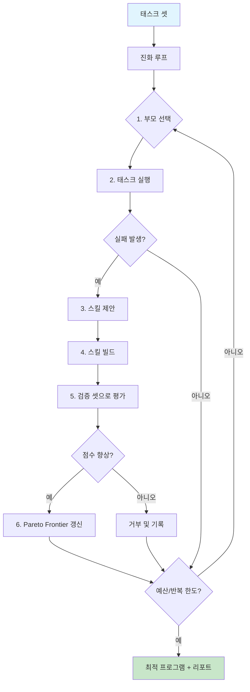

# Evolver

**LLM 코딩 에이전트를 위한 실패 기반 스킬 진화 프레임워크.**

[English](README.md)

Evolver는 실행 실패를 분석하여 LLM 에이전트용 재사용 가능한 스킬을 자동으로 발견, 개선, 검증한다. EvoSkill 아키텍처([arXiv:2603.02766](https://arxiv.org/abs/2603.02766))를 기반으로 통계적 엄밀성, 비용 제어, 크로스 모델 전이 테스트, 장기 기억 플러그인 시스템을 추가했다.

---

## 핵심 특징

- **실패 기반 진화** -- 수작업 규칙이 아닌, 에이전트가 틀린 것에서 스킬이 탄생한다. 3-에이전트 루프(Executor, Proposer, Builder)가 예산 또는 반복 한도까지 순환한다.
- **다중 실행 통계** -- 모든 후보를 `N`회 독립 실행으로 평가한다. 단일 점수가 아닌 평균, 표준편차, 신뢰구간을 리포트한다.
- **크로스 모델 전이** -- 한 에이전트(예: Claude Code)에서 발견한 스킬을 다른 에이전트(Cursor, Codex)에서 검증할 수 있다. `evolver skills test --cross-model` 사용.
- **비용 인식 진화** -- `CostTracker`가 반복마다 토큰 사용량과 USD 비용을 기록한다. `--budget-limit`으로 비용 초과 전 조기 종료.

---

## 동작 원리



루프는 세 개의 LLM 에이전트를 연동하여 실행한다:

| 에이전트 | 역할 | 패키지 |
|----------|------|--------|
| **Executor** | 현재 스킬로 태스크 셋을 실행하고 실패를 수집 | `@evolver/adapter-*` |
| **Proposer** | 실패 패턴을 분석하여 신규/수정 스킬을 제안 | `@evolver/proposer` |
| **Builder** | 제안을 SKILL.md + 선택적 스크립트로 구체화 | `@evolver/skill-builder` |

---

## 빠른 시작

```bash
# 클론 및 빌드
git clone <repo-url> && cd evolver
pnpm install
pnpm build

# 예제 태스크 셋으로 진화 실행
npx evolver evolve \
  --task-dir ./examples/claude-code/tasks \
  --adapter claude-code \
  --proposer-model claude-sonnet-4-6 \
  --builder-model claude-haiku-4-5 \
  --runs 3 \
  --budget-limit 10
```

루프가 완료되면 발견된 스킬이 `./skills/`에 저장되고 리포트가 출력된다:

```
=== Evolution Report ===
Iterations:  7
Total cost:  $2.3140
Best score:  0.8833
Best skills: chain-of-thought, geographic-lookup
```

---

## 설치

```bash
# pnpm (권장 -- 워크스페이스 네이티브 지원)
pnpm install

# npm
npm install
```

전체 패키지 빌드:

```bash
pnpm build   # 또는: npx turbo build
```

---

## CLI 레퍼런스

### `evolver evolve`

스킬 진화 루프를 실행한다.

| 플래그 | 기본값 | 설명 |
|--------|--------|------|
| `--task-dir <path>` | **필수** | `config.yaml`, `train/`, `validation/`을 포함하는 태스크 디렉토리 경로 |
| `--skills-dir <path>` | `./skills` | 발견된 스킬의 출력 디렉토리 |
| `--adapter <name>` | `claude-code` | 실행 어댑터 (`claude-code`, `cursor`, `codex`) |
| `--proposer-model <model>` | `claude-sonnet-4-6` | 실패 분석용 LLM 모델 |
| `--builder-model <model>` | `claude-haiku-4-5` | 스킬 구체화용 LLM 모델 |
| `--runs <n>` | `3` | 평가당 독립 실행 횟수 (통계적 엄밀성) |
| `--budget-limit <usd>` | 없음 | 조기 종료를 위한 최대 USD 예산 |
| `--frontier-capacity <n>` | `3` | Pareto frontier 크기 |
| `--max-iterations <n>` | `10` | 최대 진화 반복 횟수 |
| `--failure-threshold <n>` | `0.5` | 이 점수 미만을 실패로 처리 |
| `--plugin <name>` | 없음 | 로드할 플러그인 (예: `memento`) |
| `--memento-url <url>` | 없음 | Memento MCP 서버 URL (`--plugin memento` 사용 시 필수) |
| `--memento-key <key>` | 없음 | Memento MCP 접근 키 (`--plugin memento` 사용 시 필수) |

### `evolver status`

`.evolver/state.json`에서 마지막 진화 실행 상태를 표시한다: 반복 횟수, 비용, 최적 프로그램, frontier 크기, 소요 시간.

### `evolver skills list`

스킬 디렉토리에서 발견된 스킬 목록을 출력한다.

| 플래그 | 기본값 | 설명 |
|--------|--------|------|
| `--skills-dir <path>` | `./skills` | 스캔할 스킬 디렉토리 |

### `evolver skills export`

스킬을 다른 에이전트 포맷으로 내보낸다.

| 플래그 | 기본값 | 설명 |
|--------|--------|------|
| `--skills-dir <path>` | `./skills` | 스킬 디렉토리 |
| `--format <fmt>` | `cursor` | 출력 포맷 (`cursor`) |
| `--output <path>` | stdout | 출력 파일 경로 |

### `evolver skills test`

여러 모델 어댑터 간 스킬 전이를 검증한다.

| 플래그 | 기본값 | 설명 |
|--------|--------|------|
| `--skills-dir <path>` | `./skills` | 스킬 디렉토리 |
| `--task-dir <path>` | 없음 | 태스크 디렉토리 (`--cross-model` 사용 시 필수) |
| `--cross-model` | false | 크로스 모델 전이 테스트 실행 |
| `--source <adapter>` | `claude-code` | 소스 어댑터 이름 |
| `--target <adapters>` | `cursor,codex` | 쉼표로 구분된 대상 어댑터 이름 |

---

## 어댑터

어댑터는 진화 루프와 특정 LLM 에이전트 런타임을 연결한다.

### Claude Code (`claude-code`)

기본 어댑터. 스킬을 SKILL.md 파일로 Claude Code 스킬 디렉토리에 배포하고 Claude Code CLI를 통해 태스크를 실행한다.

```bash
evolver evolve --adapter claude-code --task-dir ./tasks
```

### Cursor (`cursor`)

스킬을 Cursor IDE의 `.cursorrules` 및 `rules/` 포맷으로 변환한다.

```bash
evolver evolve --adapter cursor --task-dir ./tasks
```

`SkillConverter`가 SKILL.md 소스에서 Cursor 호환 규칙 파일을 생성한다.

### Codex (`codex`)

스킬을 OpenAI Codex CLI의 `AGENTS.md` 포맷으로 변환한다.

```bash
evolver evolve --adapter codex --task-dir ./tasks
```

### 커스텀 어댑터 작성

`@evolver/core`의 `Executor` 인터페이스를 구현한다:

```typescript
import type { Executor, Program, Task, ExecutionResult } from "@evolver/core";

class MyAdapter implements Executor {
  async run(program: Program, tasks: Task[]): Promise<ExecutionResult[]> {
    // 1. program.skills를 에이전트의 스킬 디렉토리에 배포
    // 2. 에이전트의 CLI 또는 API로 각 태스크 실행
    // 3. 출력을 ExecutionResult로 파싱
    // 4. task.scorer로 점수 산정
  }
}
```

---

## 플러그인

플러그인은 진화 루프 생명주기의 다섯 개 이벤트 지점에 훅을 건다.

### 플러그인 인터페이스

```typescript
import type { Plugin } from "@evolver/core";

const myPlugin: Plugin = {
  name: "my-plugin",
  hooks: {
    async onIterationStart(ctx)  { /* 반복 컨텍스트      */ },
    async onFailure(failures)    { /* 컨텍스트 보강      */ },
    async onProposal(proposal)   { /* 제안 강화          */ },
    async onEvaluation(result)   { /* 결과 영속화        */ },
    async onFrontierUpdate(front){ /* 상태 스냅샷        */ },
  },
};
```

### Memento 플러그인 (`@evolver/plugin-memento`)

memento-mcp 서버에 연결하여 진화 세션 간 장기 시맨틱 메모리를 제공한다. 제안 생성 시 과거 실패 이력과 스킬 결과를 회상한다.

```bash
evolver evolve \
  --task-dir ./tasks \
  --plugin memento \
  --memento-url https://your-memento-server/mcp \
  --memento-key YOUR_ACCESS_KEY
```

플러그인 구성:
- `MementoClient` -- remember/recall/forget 연산을 위한 HTTP 클라이언트
- `MementoPlugin` -- `onFailure`, `onProposal`, `onEvaluation` 훅을 구현한 플러그인

---

## 아키텍처

```
evolver/
  packages/
    core/                  @evolver/core                  진화 엔진, 타입, Pareto frontier
    cli/                   @evolver/cli                   CLI 진입점 (commander)
    proposer/              @evolver/proposer              LLM 실패 분석 및 스킬 제안
    skill-builder/         @evolver/skill-builder         스킬 구체화 (SKILL.md + scripts)
    adapter-claude-code/   @evolver/adapter-claude-code   Claude Code 실행기 및 결과 파서
    adapter-cursor/        @evolver/adapter-cursor        Cursor IDE 실행기 및 스킬 변환기
    adapter-codex/         @evolver/adapter-codex         Codex CLI 실행기 및 스킬 변환기
    plugin-memento/        @evolver/plugin-memento        Memento-mcp 메모리 통합
  examples/
    claude-code/           예제 태스크 셋 (config + train + validation)
```

### 핵심 컴포넌트

| 컴포넌트 | 설명 |
|----------|------|
| `EvolutionLoop` | 메인 오케스트레이터. 선택-실행-제안-빌드-검증 사이클을 실행한다. |
| `ParetoFrontier` | 점수 기준 상위 k개 프로그램을 유지한다. 라운드 로빈 부모 선택. |
| `AdaptiveFrontier` | ParetoFrontier를 확장하여 다양성 지표(스킬 중복률, 점수 분산)에 따라 용량을 자동 조정한다. |
| `FeedbackHistory` | 모든 제안의 수락 여부와 점수 변화량을 중복 제거하여 기록한다. |
| `CostTracker` | 반복별 토큰 사용량 및 USD 비용을 추적한다. |
| `ConflictDetector` | 스킬 간 트리거 중복을 감지하고 `--max-skills` 용량을 강제한다. |
| `CrossModelTester` | 어댑터 간 스킬 전이를 검증하고 전이율(%)을 리포트한다. |
| `LlmProposer` | 실패 패턴을 분석(`groupByPattern`)하고 LLM을 통해 `SkillProposal`을 생성한다. |
| `SkillMaterializer` | 제안을 구체적인 SKILL.md 파일과 선택적 스크립트로 변환한다. |
| `META_SKILL` | 빌더가 스킬 구조에 사용하는 메타 스킬 템플릿. |

---

## 설정

### 태스크 디렉토리

```
tasks/
  config.yaml
  train/
    task-001.yaml
    task-002.yaml
  validation/
    task-010.yaml
```

**config.yaml**:

```yaml
scorer: exact-match          # exact-match | fuzzy | llm-judge | custom
categories: [math, geography, reasoning]
```

**task-001.yaml**:

```yaml
id: task-001
input: "What is the capital of South Korea?"
expected: "Seoul"
category: geography
```

### EvolutionConfig

| 옵션 | 타입 | 설명 |
|------|------|------|
| `maxIterations` | `number` | 최대 진화 반복 횟수 |
| `epochs` | `number` | 훈련용 에포크 배수 |
| `failureThreshold` | `number` | 이 점수 미만이면 실패로 수집 |
| `frontier.capacity` | `number` | Pareto frontier 크기 (k) |
| `frontier.selectionStrategy` | `string` | `"round-robin"` 또는 `"tournament"` |
| `runs` | `number` | 평가당 독립 실행 횟수 |
| `budgetLimit` | `number?` | 조기 종료를 위한 USD 상한 |
| `maxSkills` | `number` | 프로그램당 최대 스킬 수 |

---

## EvoSkill 대비 개선점

원본 EvoSkill 논문([arXiv:2603.02766](https://arxiv.org/abs/2603.02766)) 대비 개선 사항:

| EvoSkill 한계 | Evolver 해결책 |
|---------------|----------------|
| 단일 실행, 통계 없음 | `--runs N`으로 평균/표준편차/신뢰구간 리포트 |
| 비용 분석 없음 | `CostTracker`: 반복별 토큰/비용 추적, `--budget-limit` 조기 종료 |
| 스킬 충돌 무시 | `ConflictDetector`: 트리거 중복 감지, `--max-skills` 제한 |
| 단일 모델만 지원 | `--proposer-model` / `--builder-model` 분리로 비용 최적화 |
| 고정 frontier k=3 | `--frontier-capacity` 수동 설정 + `AdaptiveFrontier` 자동 조정 |
| 크로스 모델 검증 없음 | `CrossModelTester`: 어댑터 간 스킬 전이율 측정 |
| 장기 기억 없음 | `plugin-memento`: 진화 세션 간 시맨틱 메모리 |
| 플러그인 시스템 없음 | 생명주기 훅: `onFailure`, `onProposal`, `onEvaluation`, `onFrontierUpdate` |

---

## 기여

```bash
# 의존성 설치
pnpm install

# 전체 패키지 빌드
pnpm build

# 테스트 실행
pnpm test

# 린트
pnpm lint
```

프로젝트는 pnpm 워크스페이스 + turborepo를 사용한다. `packages/` 하위의 각 패키지는 독립적으로 빌드 및 테스트할 수 있다.

새 어댑터를 추가하려면 `packages/adapter-<name>/` 하위에 `@evolver/core`의 `Executor` 인터페이스를 구현하는 패키지를 생성한다. 새 플러그인은 `Plugin` 인터페이스를 구현한다.

---

## 라이선스

[MIT](LICENSE)

---

## 참고

- **EvoSkill**: [arXiv:2603.02766](https://arxiv.org/abs/2603.02766) -- *EvoSkill: Automated Skill Discovery for LLM Agents*
- **기술 스택**: TypeScript, Node.js 20+, pnpm workspaces, turborepo, vitest
