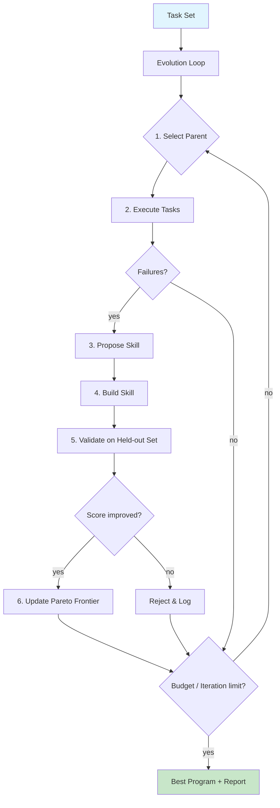

# skill-evolver

**Failure-driven skill evolution for LLM coding agents.**

[](https://www.npmjs.com/package/@nerdvana/evolver-cli)
[](LICENSE)
[](https://github.com/JinHo-von-Choi/skill-evolver)

[한국어](README.ko.md)

Evolver automatically discovers, refines, and validates reusable skills for LLM agents by analyzing execution failures. Based on the EvoSkill architecture ([arXiv:2603.02766](https://arxiv.org/abs/2603.02766)), it adds statistical rigor, cost controls, cross-model transfer testing, and a plugin system for long-term memory.

---

## Table of Contents

- [Quick Start](#quick-start)
- [Installation](#installation)
- [How It Works](#how-it-works)
- [CLI Reference](#cli-reference)
- [Adapters](#adapters)
- [Plugins](#plugins)
- [Architecture](#architecture)
- [Configuration](#configuration)
- [EvoSkill Improvements](#evoskill-improvements)
- [Contributing](#contributing)

---

## Quick Start

### Use via npm (recommended)

```bash
npm install -g @nerdvana/evolver-cli
```

Run evolution on the bundled example task set:

```bash
evolver evolve \
  --task-dir ./examples/claude-code/tasks \
  --adapter claude-code \
  --runs 3 \
  --budget-limit 10
```

After the loop finishes, discovered skills are written to `./skills/` and a report is printed:

```
=== Evolution Report ===
Iterations:  7
Total cost:  $2.3140
Best score:  0.8833
Best skills: chain-of-thought, geographic-lookup
```

### Use as a library

```bash
npm install @nerdvana/evolver-core @nerdvana/evolver-proposer @nerdvana/evolver-skill-builder
```

```typescript
import { EvolutionLoop }     from "@nerdvana/evolver-core";
import { LlmProposer }       from "@nerdvana/evolver-proposer";
import { SkillMaterializer } from "@nerdvana/evolver-skill-builder";
```

---

## Highlights

- **Failure-driven evolution** — Skills emerge from what the agent gets wrong, not from hand-written rules. A 3-agent loop (Executor, Proposer, Builder) iterates until a budget or iteration cap is reached.
- **Multi-run statistics** — Every candidate is evaluated across `N` independent runs. Reports include mean, standard deviation, and confidence intervals instead of single-shot scores.
- **Cross-model transfer** — Skills discovered on one agent (e.g. Claude Code) can be validated on others (Cursor, Codex) via `evolver skills test --cross-model`.
- **Cost-aware evolution** — `CostTracker` records per-iteration token usage and USD spend. `--budget-limit` triggers early termination before costs spiral.

---

## Installation

### CLI (global)

```bash
# npm
npm install -g @nerdvana/evolver-cli

# pnpm
pnpm add -g @nerdvana/evolver-cli

# yarn
yarn global add @nerdvana/evolver-cli
```

### Packages (programmatic use)

```bash
# Core engine only
npm install @nerdvana/evolver-core

# Full stack
npm install @nerdvana/evolver-core \
            @nerdvana/evolver-proposer \
            @nerdvana/evolver-skill-builder \
            @nerdvana/evolver-adapter-claude-code
```

### Available packages

| Package | Description |
|---------|-------------|
| `@nerdvana/evolver-cli` | CLI entry point (`evolver` command) |
| `@nerdvana/evolver-core` | Evolution engine, types, Pareto frontier |
| `@nerdvana/evolver-proposer` | LLM failure analysis & skill proposal |
| `@nerdvana/evolver-skill-builder` | Skill materialization (SKILL.md + scripts) |
| `@nerdvana/evolver-adapter-claude-code` | Claude Code executor & result parser |
| `@nerdvana/evolver-adapter-cursor` | Cursor IDE executor & skill converter |
| `@nerdvana/evolver-adapter-codex` | Codex CLI executor & skill converter |
| `@nerdvana/evolver-plugin-memento` | Memento-mcp memory integration |

### Requirements

- Node.js 20+
- `ANTHROPIC_API_KEY` environment variable (for Proposer and Builder LLMs)

```bash
export ANTHROPIC_API_KEY=sk-ant-...
```

---

## How It Works



The loop runs three LLM-powered agents in concert:

| Agent | Role | Package |
|-------|------|---------|
| **Executor** | Runs the task set with current skills, collects failures | `@nerdvana/evolver-adapter-*` |
| **Proposer** | Analyzes failure patterns, proposes a new or edited skill | `@nerdvana/evolver-proposer` |
| **Builder** | Materializes the proposal into a SKILL.md + optional scripts | `@nerdvana/evolver-skill-builder` |

---

## CLI Reference

### `evolver evolve`

Run the skill evolution loop.

| Flag | Default | Description |
|------|---------|-------------|
| `--task-dir <path>` | **required** | Path to task directory containing `config.yaml`, `train/`, `validation/` |
| `--skills-dir <path>` | `./skills` | Output directory for discovered skills |
| `--adapter <name>` | `claude-code` | Executor adapter (`claude-code`, `cursor`, `codex`) |
| `--proposer-model <model>` | `claude-sonnet-4-6` | LLM model for failure analysis |
| `--builder-model <model>` | `claude-haiku-4-5` | LLM model for skill materialization |
| `--runs <n>` | `3` | Independent runs per evaluation (statistical rigor) |
| `--budget-limit <usd>` | none | Maximum USD spend before early termination |
| `--frontier-capacity <n>` | `3` | Pareto frontier size |
| `--max-iterations <n>` | `10` | Maximum evolution iterations |
| `--failure-threshold <n>` | `0.5` | Score below this is treated as failure |
| `--plugin <name>` | none | Plugin to load (e.g. `memento`) |
| `--memento-url <url>` | none | Memento MCP server URL (required with `--plugin memento`) |
| `--memento-key <key>` | none | Memento MCP access key (required with `--plugin memento`) |

### `evolver status`

Show the last evolution run from `.evolver/state.json`: iterations, cost, best program, frontier size, duration.

### `evolver skills list`

List discovered skills in the skills directory.

| Flag | Default | Description |
|------|---------|-------------|
| `--skills-dir <path>` | `./skills` | Skills directory to scan |

### `evolver skills export`

Export skills to another agent format.

| Flag | Default | Description |
|------|---------|-------------|
| `--skills-dir <path>` | `./skills` | Skills directory |
| `--format <fmt>` | `cursor` | Output format (`cursor`) |
| `--output <path>` | stdout | Output file path |

### `evolver skills test`

Validate skills across different model adapters.

| Flag | Default | Description |
|------|---------|-------------|
| `--skills-dir <path>` | `./skills` | Skills directory |
| `--task-dir <path>` | none | Tasks directory (required with `--cross-model`) |
| `--cross-model` | false | Run cross-model transfer test |
| `--source <adapter>` | `claude-code` | Source adapter name |
| `--target <adapters>` | `cursor,codex` | Comma-separated target adapter names |

---

## Adapters

Adapters bridge the evolution loop with specific LLM agent runtimes.

### Claude Code (`claude-code`)

The default adapter. Deploys skills as SKILL.md files into the Claude Code skill directory and executes tasks via the Claude Code CLI.

```bash
evolver evolve --adapter claude-code --task-dir ./tasks
```

### Cursor (`cursor`)

Converts skills into `.cursorrules` and `rules/` format for the Cursor IDE.

```bash
evolver evolve --adapter cursor --task-dir ./tasks
```

### Codex (`codex`)

Converts skills into `AGENTS.md` format for the OpenAI Codex CLI.

```bash
evolver evolve --adapter codex --task-dir ./tasks
```

### Writing a Custom Adapter

Implement the `Executor` interface from `@nerdvana/evolver-core`:

```typescript
import type { Executor, Program, Task, ExecutionResult } from "@nerdvana/evolver-core";

class MyAdapter implements Executor {
  async run(program: Program, tasks: Task[]): Promise<ExecutionResult[]> {
    // 1. Deploy program.skills to the agent's skill directory
    // 2. Execute each task via the agent's CLI or API
    // 3. Parse output into ExecutionResult
    // 4. Score with task.scorer
  }
}
```

---

## Plugins

Plugins hook into the evolution loop lifecycle via five event points.

### Plugin Interface

```typescript
import type { Plugin } from "@nerdvana/evolver-core";

const myPlugin: Plugin = {
  name: "my-plugin",
  hooks: {
    async onIterationStart(ctx)  { /* iteration context   */ },
    async onFailure(failures)    { /* enrich with context */ },
    async onProposal(proposal)   { /* augment proposal    */ },
    async onEvaluation(result)   { /* persist outcome     */ },
    async onFrontierUpdate(front){ /* snapshot state      */ },
  },
};
```

### Memento Plugin (`@nerdvana/evolver-plugin-memento`)

Connects to a memento-mcp server for long-term semantic memory across evolution sessions. Past failures and skill outcomes are recalled during proposal generation.

```bash
evolver evolve \
  --task-dir ./tasks \
  --plugin memento \
  --memento-url https://your-memento-server/mcp \
  --memento-key YOUR_ACCESS_KEY
```

The plugin provides:
- `MementoClient` — HTTP client for remember/recall/forget operations
- `MementoPlugin` — Plugin implementation with `onFailure`, `onProposal`, and `onEvaluation` hooks

---

## Architecture

```
skill-evolver/
  packages/
    core/                  @nerdvana/evolver-core                  Evolution engine, types, Pareto frontier
    cli/                   @nerdvana/evolver-cli                   CLI entry point (commander)
    proposer/              @nerdvana/evolver-proposer              LLM failure analysis & skill proposal
    skill-builder/         @nerdvana/evolver-skill-builder         Skill materialization (SKILL.md + scripts)
    adapter-claude-code/   @nerdvana/evolver-adapter-claude-code   Claude Code executor & result parser
    adapter-cursor/        @nerdvana/evolver-adapter-cursor        Cursor IDE executor & skill converter
    adapter-codex/         @nerdvana/evolver-adapter-codex         Codex CLI executor & skill converter
    plugin-memento/        @nerdvana/evolver-plugin-memento        Memento-mcp memory integration
  examples/
    claude-code/           Example task set (config + train + validation)
```

### Core Components

| Component | Description |
|-----------|-------------|
| `EvolutionLoop` | Main orchestrator. Runs the select-execute-propose-build-validate cycle. |
| `ParetoFrontier` | Maintains top-k programs by score. Round-robin parent selection. |
| `AdaptiveFrontier` | Extends ParetoFrontier with automatic capacity adjustment based on diversity metrics (skill overlap rate, score variance). |
| `FeedbackHistory` | Deduplicated log of all proposals, their acceptance status, and score deltas. |
| `CostTracker` | Per-iteration token usage and USD cost accounting. |
| `ConflictDetector` | Detects trigger overlap between skills; enforces `--max-skills` capacity. |
| `CrossModelTester` | Validates skill transfer across adapters; reports transfer rate percentage. |
| `LlmProposer` | Analyzes failure patterns (`groupByPattern`) and generates `SkillProposal` via LLM. |
| `SkillMaterializer` | Converts proposals into concrete SKILL.md files with optional scripts. |
| `META_SKILL` | Meta-skill template used by the builder for skill structure. |

---

## Configuration

### Task Directory

```
tasks/
  config.yaml
  train/
    task-001.yaml
    task-002.yaml
  validation/
    task-010.yaml
```

**config.yaml**:

```yaml
scorer: exact-match          # exact-match | fuzzy | llm-judge | custom
categories: [math, geography, reasoning]
```

**task-001.yaml**:

```yaml
id: task-001
input: "What is the capital of South Korea?"
expected: "Seoul"
category: geography
```

### EvolutionConfig

| Option | Type | Description |
|--------|------|-------------|
| `maxIterations` | `number` | Maximum evolution iterations |
| `epochs` | `number` | Epoch multiplier for training |
| `failureThreshold` | `number` | Score below this triggers failure collection |
| `frontier.capacity` | `number` | Pareto frontier size (k) |
| `frontier.selectionStrategy` | `string` | `"round-robin"` or `"tournament"` |
| `runs` | `number` | Independent runs per evaluation |
| `budgetLimit` | `number?` | USD cap for early termination |
| `maxSkills` | `number` | Maximum skills per program |

---

## EvoSkill Improvements

Enhancements over the original EvoSkill paper ([arXiv:2603.02766](https://arxiv.org/abs/2603.02766)):

| EvoSkill Limitation | Evolver Solution |
|---------------------|------------------|
| Single run, no statistics | `--runs N` with mean/stddev/CI report |
| No cost analysis | `CostTracker`: per-iteration token/cost accounting, `--budget-limit` early stop |
| Skill conflicts ignored | `ConflictDetector`: trigger overlap detection, `--max-skills` cap |
| Single model only | Separate `--proposer-model` / `--builder-model` for cost optimization |
| Fixed frontier k=3 | `--frontier-capacity` manual override + `AdaptiveFrontier` auto-tuning |
| No cross-model validation | `CrossModelTester`: skill transfer rate across adapters |
| No long-term memory | `plugin-memento`: semantic memory across evolution sessions |
| No plugin system | Lifecycle hooks: `onFailure`, `onProposal`, `onEvaluation`, `onFrontierUpdate` |

---

## Contributing

```bash
# Clone and install
git clone https://github.com/JinHo-von-Choi/skill-evolver.git
cd skill-evolver
pnpm install

# Build all packages
pnpm build

# Run tests
pnpm test

# Lint
pnpm lint
```

The project uses pnpm workspaces + turborepo. Each package under `packages/` is independently buildable and testable.

To add a new adapter, create a package under `packages/adapter-<name>/` implementing the `Executor` interface from `@nerdvana/evolver-core`. To add a new plugin, implement the `Plugin` interface.

---

## License

[MIT](LICENSE)

---

## References

- **EvoSkill**: [arXiv:2603.02766](https://arxiv.org/abs/2603.02766) — *EvoSkill: Automated Skill Discovery for LLM Agents*
- **Stack**: TypeScript, Node.js 20+, pnpm workspaces, turborepo, vitest
